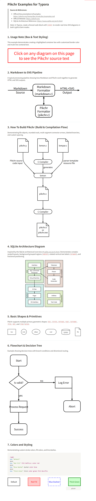
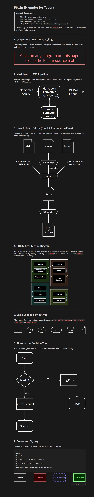

# Typora Pikchr Plugin

A plugin for [Typora](https://typora.io/) that brings real-time rendering support and language auto-complete for [Pikchr](https://pikchr.org/) diagrams. Fully compatible with the [typora-community-plugin](https://github.com/typora-community-plugin/typora-community-plugin) loader framework.

---

## 💡 What is Pikchr?

Pikchr (pronounced "picture") is a PIC-like markup language designed by D. Richard Hipp (creator of SQLite and Fossil) for diagrams in technical documentation.

---

## 📸 Screenshots & Samples

Typora Pikchr plugin delivers real-time live preview rendering with native Light and Dark theme synchronization. When the editor loses focus, code blocks are automatically hidden to present clean diagram visuals.

### ☀️ Light Mode Preview


### 🌙 Dark Mode Preview


> 💡 *Check out [examples.md](doc_assets/examples.md) for full runnable syntax examples (SQLite architecture, pipelines, flowcharts, build trees, and primitives).*

---

## 🚀 Features

- **Language Autocomplete**: Typing ` ```pik ` or entering language names in code fences automatically suggests `Pikchr` in Typora's dropdown.
- **Syntax Highlighting**: Includes CodeMirror syntax highlighting rules for Pikchr shapes, keywords, colors, and coordinates.
- **Native Diagram Panel Integration**: Uses Typora's native `.md-diagram-panel` container with responsive live-preview.
- **Embedded WebAssembly Engine**: 100% offline, zero network requests, near-native performance.
- **Auto Focus/View Toggle**: Hides raw code when not editing for clean document viewing.
- **Theme Luminance Detection**: Automatically matches SVG fill & stroke colors with light/dark Typora themes.
- **Community Plugin Loader Support**: Seamless installation, toggle on/off, and persistent settings.
- **Internationalization (I18n)**: English, 한국어, 简体中文.

---

## 📝 Example Syntax

In Typora, write a code fence with language set to `pikchr` (you can use autocomplete by typing `pik`):

````markdown
```pikchr
box "Pikchr Engine" fill 0xe0f7fa
arrow
circle "Typora" fill 0xfff9c4
arrow
box "Live Preview" fill 0xe8f5e9
```
````

---

## 📦 Installation & Setup

### Method 1: Community Plugin Marketplace (Recommended)
1. In Typora, open **Settings -> Community Plugins**.
2. Search for **Pikchr Diagram Renderer** and click **Install**.
3. Enable the plugin.

### Method 2: Manual Installation (No Node.js / npm required)
1. Download `plugin.zip` from the latest [Releases](https://github.com/OnionStar0325/TyporaPlugins/releases) or download/clone the `typora-plugin-pikchr` folder (pre-built with `main.js`, `manifest.json`, and `styles.css`).
2. Copy the plugin folder into your Typora plugins directory:
   - **Windows**: `%APPDATA%\Typora\plugins\plugins\typora-plugin-pikchr\`
   - **macOS**: `~/Library/Application Support/abnerworks.Typora/plugins/plugins/typora-plugin-pikchr/`
   - **Linux**: `~/.config/Typora/plugins/plugins/typora-plugin-pikchr/`
3. Restart Typora (or reload) and toggle the plugin **ON** in **Settings -> Community Plugins**.

---

## 🛠️ Development & Building

```bash
# Install dependencies
npm install

# Build main.js, styles.css, and standalone bundle
npm run build

# Run unit tests
npm test

# Package into plugin.zip for Community Marketplace release
npm run pack # or pnpm run pack
```

---

## 📜 Upstream & Licensing

- **Plugin Code & Integration**: [MIT License](LICENSE)
- **Pikchr Engine (`pikchr.c` / WASM)**: [0-Clause BSD (0BSD)](https://pikchr.org/home/doc/trunk/homepage.md) / Public Domain equivalent.
